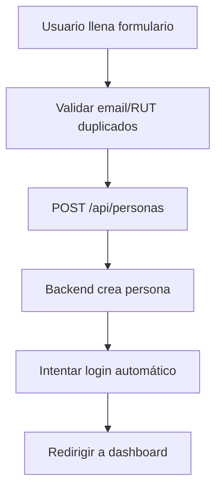
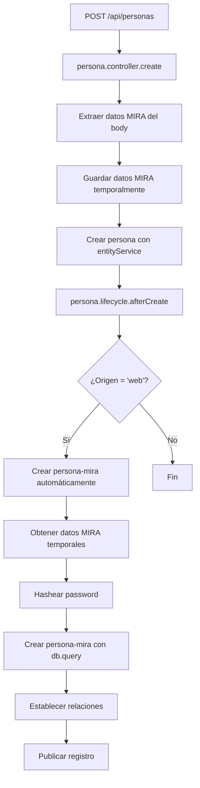

# Documentación Completa: Sistema de Registro MIRA · Estudiante

## 📋 Índice
1. [Estado Actual](#estado-actual)
2. [Arquitectura del Sistema](#arquitectura-del-sistema)
3. [Flujo de Registro](#flujo-de-registro)
4. [Código Completo](#código-completo)
5. [Problemas Encontrados](#problemas-encontrados)
6. [Intentos de Solución](#intentos-de-solución)
7. [Próximos Pasos](#próximos-pasos)

---

## 🔴 Estado Actual

### ✅ Lo que funciona:
- **Registro de Persona**: El frontend puede crear registros en el Content-Type `persona` correctamente
- **Login con Persona**: El login funciona usando el Content-Type `persona` directamente
- **Validación de duplicados**: Se verifica que no existan emails o RUTs duplicados antes de registrar

### ❌ Lo que NO funciona:
- **Creación automática en MIRA · Estudiante**: Cuando se crea una `persona` desde el frontend, NO se crea automáticamente el registro correspondiente en el Content-Type `MIRA · Estudiante` (persona-mira)
- **Datos faltantes**: Los campos específicos de MIRA (email, password, nivel, curso, colegio) no se están guardando en `persona-mira`

### 📊 Resumen del Problema:
El sistema está diseñado para que cuando se registre un estudiante desde el frontend (Mira-Almonte):
1. Se cree un registro en `persona` ✅ (funciona)
2. Se cree automáticamente un registro en `MIRA · Estudiante` ❌ (NO funciona)
3. Se vinculen ambos registros mediante la relación `persona` en `persona-mira` ❌ (NO funciona)

---

## 🏗️ Arquitectura del Sistema

### Content-Types Involucrados:

#### 1. `persona` (api::persona.persona)
- **Propósito**: Almacena información general de personas (estudiantes, profesores, etc.)
- **Campos principales**:
  - `rut` (string, único)
  - `nombres` (string)
  - `primer_apellido` (string)
  - `segundo_apellido` (string)
  - `emails` (component, array de emails)
  - `telefonos` (component, array de teléfonos)
  - `origen` (enum: 'web', 'admin', 'importacion', etc.)

#### 2. `MIRA · Estudiante` (api::persona-mira.persona-mira)
- **Propósito**: Almacena información específica de estudiantes MIRA
- **Campos principales**:
  - `email` (string, único, private)
  - `password` (string, private) - Campo privado que requiere hashing
  - `persona` (relation, manyToOne) - Relación con `api::persona.persona`
  - `colegio` (relation, manyToOne) - Relación con `api::colegio.colegio`
  - `nivel` (string) - Ej: "1-medio", "2-medio", etc.
  - `curso` (string) - Ej: "a", "b", "c", etc.
  - `activo` (boolean)
  - `fecha_registro` (datetime)
  - `publishedAt` (datetime) - Para draftAndPublish

### Relación entre Content-Types:
```
persona (1) ──────< (many) persona-mira
```
- Una `persona` puede tener múltiples `persona-mira` (aunque en la práctica es 1:1)
- `persona-mira` tiene una relación `manyToOne` con `persona`

---

## 🔄 Flujo de Registro

### Flujo Actual (Frontend):



### Flujo Esperado (Backend):



---

## 💻 Código Completo

### 1. Frontend - Página de Registro

**Archivo**: `C:\Trabajo\Mira-Almonte\src\app\register\page.tsx`

```typescript
// Flujo de registro desde el frontend
const handleRegister = async (formData) => {
  // 1. Validar duplicados
  const emailExists = await checkEmailExists(formData.email);
  const rutExists = await checkRutExists(formData.rut);
  
  if (emailExists || rutExists) {
    throw new Error('Email o RUT ya registrado');
  }
  
  // 2. Preparar datos para persona
  const personaData = {
    rut: formData.rut,
    nombres: formData.nombres,
    primer_apellido: formData.primer_apellido,
    segundo_apellido: formData.segundo_apellido,
    origen: 'web',
    emails: [{
      email: formData.email,
      tipo: 'personal',
      principal: true
    }],
    // Datos MIRA específicos (prefijo _mira_)
    _mira_password: formData.password,
    _mira_colegio: formData.colegio,
    _mira_nivel: formData.nivel,
    _mira_curso: formData.curso
  };
  
  // 3. Crear persona
  const response = await fetch('/api/personas', {
    method: 'POST',
    headers: { 'Content-Type': 'application/json' },
    body: JSON.stringify({ data: personaData })
  });
  
  if (!response.ok) {
    throw new Error('Error al crear persona');
  }
  
  // 4. Intentar login automático (opcional)
  try {
    await loginMiraEstudiante(formData.email, formData.password);
    router.push('/dashboard');
  } catch (error) {
    // Si falla el login, redirigir a página de login
    router.push('/login');
  }
};
```

### 2. Backend - Controller de Persona

**Archivo**: `strapi/src/api/persona/controllers/persona.ts`

```typescript
import { factories } from '@strapi/strapi';

export default factories.createCoreController('api::persona.persona' as any, ({ strapi }) => ({
  async create(ctx: any) {
    try {
      strapi.log.info('[persona.create] ═══════════════════════════════════════════════════════');
      strapi.log.info('[persona.create] Método create ejecutado');
      
      const body = ctx.request.body?.data || ctx.request.body;
      strapi.log.info('[persona.create] Raw body keys:', Object.keys(body || {}));
      strapi.log.info('[persona.create] Body keys:', Object.keys(body || {}));
      
      // Extraer datos MIRA específicos del body
      const datosMira: any = {};
      const camposMira = ['_mira_password', '_mira_colegio', '_mira_nivel', '_mira_curso'];
      
      camposMira.forEach(campo => {
        if (body[campo] !== undefined) {
          const campoLimpio = campo.replace('_mira_', '');
          datosMira[campoLimpio] = body[campo];
          delete body[campo]; // Eliminar del body para que no se guarde en persona
        }
      });
      
      strapi.log.info('[persona.create] Datos MIRA extraídos:', {
        tienePassword: !!datosMira.password,
        tieneColegio: !!datosMira.colegio,
        tieneNivel: !!datosMira.nivel,
        tieneCurso: !!datosMira.curso
      });
      
      // Obtener email principal para usar como clave en el Map temporal
      let emailPrincipal = '';
      if (body.emails && Array.isArray(body.emails) && body.emails.length > 0) {
        const emailPrincipalObj = body.emails.find((e: any) => e.principal) || body.emails[0];
        emailPrincipal = emailPrincipalObj?.email || '';
      }
      
      strapi.log.info('[persona.create] Email encontrado:', emailPrincipal);
      
      // Inicializar Map temporal si no existe
      if (!(strapi as any).__datosMiraTemporales) {
        (strapi as any).__datosMiraTemporales = new Map();
        strapi.log.info('[persona.create] Map temporal inicializado');
      }
      
      // Guardar datos MIRA temporalmente usando email como clave
      if (emailPrincipal && Object.keys(datosMira).length > 0) {
        (strapi as any).__datosMiraTemporales.set(emailPrincipal.toLowerCase().trim(), datosMira);
        strapi.log.info(`[persona.create] ✅ Datos MIRA guardados temporalmente para email: ${emailPrincipal}`);
        strapi.log.info(`[persona.create] Map tiene ${(strapi as any).__datosMiraTemporales.size} entradas`);
      }
      
      strapi.log.info('[persona.create] Creando persona con body limpio (sin campos MIRA)...');
      
      // Crear persona usando entityService (sin campos MIRA)
      const result = await strapi.entityService.create('api::persona.persona' as any, {
        data: body,
      });
      
      strapi.log.info('[persona.create] ✅ Persona creada:', {
        id: result?.id,
        documentId: result?.documentId,
        rut: (result as any)?.rut
      });
      
      return ctx.created({ data: result });
    } catch (error: any) {
      strapi.log.error('[persona.create] Error:', error);
      return ctx.internalServerError(error.message || 'Error al crear persona');
    }
  }
}));
```

### 3. Backend - Lifecycle de Persona

**Archivo**: `strapi/src/api/persona/content-types/persona/lifecycles.ts`

```typescript
export default {
  async afterCreate(event: any) {
    const { result } = event;
    
    strapi.log.info('[persona.lifecycle] ═══════════════════════════════════════════════════════');
    strapi.log.info('[persona.lifecycle] afterCreate ejecutado');
    strapi.log.info('[persona.lifecycle] Event result:', {
      id: result?.id,
      documentId: result?.documentId,
      origen: (result as any)?.origen
    });
    
    // Verificar condiciones para crear persona-mira
    const origen = (result as any)?.origen;
    strapi.log.info('[persona.lifecycle] Verificando condiciones:');
    strapi.log.info('[persona.lifecycle] Origen:', origen);
    
    // Solo crear persona-mira si el origen es 'web' (registro desde frontend)
    if (origen !== 'web') {
      strapi.log.info('[persona.lifecycle] Origen no es "web", no se crea persona-mira');
      return;
    }
    
    strapi.log.info('[persona.lifecycle] ✅ Origen es "web", procediendo a crear persona-mira...');
    
    try {
      // Obtener persona completa con emails
      const personaId = result.id;
      strapi.log.info(`[persona.lifecycle] Buscando persona con ID: ${personaId}`);
      
      const personaCompleta = await strapi.entityService.findOne('api::persona.persona' as any, personaId, {
        populate: ['emails'],
      });
      
      if (!personaCompleta) {
        strapi.log.error(`[persona.lifecycle] No se encontró persona con ID: ${personaId}`);
        return;
      }
      
      strapi.log.info('[persona.lifecycle] Persona completa obtenida:', {
        id: personaCompleta.id,
        rut: (personaCompleta as any).rut,
        tieneEmails: !!(personaCompleta as any)?.emails
      });
      
      // Obtener email principal
      let primaryEmail = '';
      const emails = (personaCompleta as any)?.emails || [];
      if (emails.length > 0) {
        const emailPrincipalObj = emails.find((e: any) => e.principal) || emails[0];
        primaryEmail = emailPrincipalObj?.email || '';
      }
      
      if (!primaryEmail) {
        strapi.log.error('[persona.lifecycle] No se encontró email principal en la persona');
        return;
      }
      
      strapi.log.info('[persona.lifecycle] Email principal encontrado:', primaryEmail);
      
      // Buscar datos MIRA en Map temporal
      strapi.log.info('[persona.lifecycle] Buscando datos MIRA en Map temporal...');
      const mapTemporal = (strapi as any).__datosMiraTemporales;
      
      if (!mapTemporal) {
        strapi.log.error('[persona.lifecycle] Map temporal no existe');
        return;
      }
      
      strapi.log.info('[persona.lifecycle] Map existe:', !!mapTemporal);
      strapi.log.info('[persona.lifecycle] Map size:', mapTemporal.size);
      
      const emailKey = primaryEmail.toLowerCase().trim();
      const personaMiraData = mapTemporal.get(emailKey);
      
      if (!personaMiraData) {
        strapi.log.warn(`[persona.lifecycle] No se encontraron datos MIRA para email: ${emailKey}`);
        strapi.log.warn(`[persona.lifecycle] Map keys:`, Array.from(mapTemporal.keys()));
        return;
      }
      
      strapi.log.info('[persona.lifecycle] Datos MIRA encontrados:', {
        tienePassword: !!personaMiraData.password,
        tieneColegio: !!personaMiraData.colegio,
        tieneNivel: !!personaMiraData.nivel,
        tieneCurso: !!personaMiraData.curso
      });
      
      // Verificar que haya password (requerido)
      if (!personaMiraData.password) {
        strapi.log.error('[persona.lifecycle] No se recibió password en datos MIRA');
        return;
      }
      
      strapi.log.info(`[persona.lifecycle] ✅ Creando persona-mira automáticamente para persona ID=${personaId}, RUT=${(personaCompleta as any).rut}, email=${primaryEmail}`);
      
      // Preparar datos para crear persona-mira
      strapi.log.info('[persona.lifecycle] Datos para crear persona-mira:', {
        email: primaryEmail,
        tienePassword: !!personaMiraData.password,
        nivel: personaMiraData.nivel,
        curso: personaMiraData.curso,
        colegio: personaMiraData.colegio
      });
      
      // CRÍTICO: Usar db.query para crear directamente el registro publicado
      // entityService.create con publishedAt crea draft y published, causando problemas con password
      const personaIdNumerico = personaId;
      
      strapi.log.info(`[persona.lifecycle] Creando persona-mira con db.query (publicado directamente), persona ID: ${personaIdNumerico}`);
      
      // CRÍTICO: Hashear password ANTES de crear con db.query
      // db.query no dispara beforeCreate, así que debemos hashearlo manualmente
      const bcrypt = require('bcryptjs');
      let passwordHasheado = personaMiraData.password;
      const passwordStr = String(personaMiraData.password || '');
      
      // Verificar si ya está hasheado
      const isHashed = passwordStr.startsWith('$2a$') || passwordStr.startsWith('$2b$');
      if (!isHashed && passwordStr.length > 0) {
        strapi.log.info('[persona.lifecycle] Hasheando password antes de crear con db.query');
        passwordHasheado = bcrypt.hashSync(passwordStr, 10);
        strapi.log.info('[persona.lifecycle] Password hasheado correctamente, longitud:', passwordHasheado.length);
      } else if (isHashed) {
        strapi.log.info('[persona.lifecycle] Password ya está hasheado, usando directamente');
        passwordHasheado = passwordStr;
      }
      
      // Preparar datos para crear persona-mira
      const datosParaCrear: any = {
        email: primaryEmail,
        password: passwordHasheado, // Password hasheado manualmente
        fecha_registro: personaMiraData.fecha_registro || new Date(),
        activo: personaMiraData.activo !== undefined ? personaMiraData.activo : true,
        publishedAt: new Date(), // Publicar automáticamente
      };
      
      // Agregar campos escalares (no relaciones)
      if (personaMiraData.nivel !== undefined && personaMiraData.nivel !== null) {
        datosParaCrear.nivel = personaMiraData.nivel;
      }
      if (personaMiraData.curso !== undefined && personaMiraData.curso !== null) {
        datosParaCrear.curso = personaMiraData.curso;
      }
      
      // Agregar relaciones directamente a los datos para crear
      if (personaIdNumerico) {
        datosParaCrear.persona = personaIdNumerico;
        strapi.log.info(`[persona.lifecycle] Agregando relación persona: ${personaIdNumerico}`);
      }
      
      if (personaMiraData.colegio !== undefined && personaMiraData.colegio !== null) {
        const colegioIdNumerico = typeof personaMiraData.colegio === 'number' 
          ? personaMiraData.colegio 
          : (typeof personaMiraData.colegio === 'string' 
            ? parseInt(personaMiraData.colegio, 10) 
            : personaMiraData.colegio);
        if (colegioIdNumerico) {
          datosParaCrear.colegio = colegioIdNumerico;
          strapi.log.info(`[persona.lifecycle] Agregando relación colegio: ${colegioIdNumerico}`);
        }
      }
      
      strapi.log.info(`[persona.lifecycle] Datos completos para crear:`, {
        email: datosParaCrear.email,
        tienePassword: !!datosParaCrear.password,
        passwordLength: datosParaCrear.password ? String(datosParaCrear.password).length : 0,
        nivel: datosParaCrear.nivel,
        curso: datosParaCrear.curso,
        activo: datosParaCrear.activo,
        persona: datosParaCrear.persona,
        colegio: datosParaCrear.colegio,
        publishedAt: datosParaCrear.publishedAt
      });
      
      // Crear persona-mira con TODOS los campos incluyendo relaciones usando db.query
      // db.query crea directamente el registro publicado sin crear draft
      const personaMiraCreada = await strapi.db.query('api::persona-mira.persona-mira').create({
        data: datosParaCrear,
      });
      
      strapi.log.info(`[persona.lifecycle] Persona-mira creada con ID: ${personaMiraCreada?.id}, publishedAt: ${personaMiraCreada?.publishedAt}`);
      
      // Verificar que los campos básicos se guardaron correctamente
      const registroVerificado = await strapi.db.query('api::persona-mira.persona-mira').findOne({
        where: { id: personaMiraCreada.id },
        select: ['id', 'email', 'password', 'nivel', 'curso', 'activo', 'fecha_registro', 'publishedAt'],
      });
      
      strapi.log.info(`[persona.lifecycle] Verificación db.query - ID: ${registroVerificado?.id}, email: ${registroVerificado?.email}, nivel: ${registroVerificado?.nivel}, curso: ${registroVerificado?.curso}, activo: ${registroVerificado?.activo}, publishedAt: ${registroVerificado?.publishedAt}`);
      
      if (registroVerificado) {
        if (registroVerificado.password) {
          const hashFormat = String(registroVerificado.password).substring(0, 4);
          const hashLength = String(registroVerificado.password).length;
          strapi.log.info(`[persona.lifecycle] Password guardado correctamente - Formato: ${hashFormat}, Longitud: ${hashLength}`);
        } else {
          strapi.log.error(`[persona.lifecycle] ⚠️ CRÍTICO: Password no se guardó correctamente para ${personaMiraCreada.id}`);
        }
        
        // Verificar y corregir campos faltantes
        const camposFaltantes: any = {};
        if (!registroVerificado.email && datosParaCrear.email) {
          camposFaltantes.email = datosParaCrear.email;
          strapi.log.warn(`[persona.lifecycle] ⚠️ Email no se guardó, agregando: ${datosParaCrear.email}`);
        }
        if (!registroVerificado.nivel && datosParaCrear.nivel) {
          camposFaltantes.nivel = datosParaCrear.nivel;
          strapi.log.warn(`[persona.lifecycle] ⚠️ Nivel no se guardó, agregando: ${datosParaCrear.nivel}`);
        }
        if (!registroVerificado.curso && datosParaCrear.curso) {
          camposFaltantes.curso = datosParaCrear.curso;
          strapi.log.warn(`[persona.lifecycle] ⚠️ Curso no se guardó, agregando: ${datosParaCrear.curso}`);
        }
        if (!registroVerificado.publishedAt) {
          camposFaltantes.publishedAt = new Date();
          strapi.log.warn(`[persona.lifecycle] ⚠️ publishedAt no se guardó, publicando ahora...`);
        }
        
        // Actualizar campos faltantes si hay alguno
        if (Object.keys(camposFaltantes).length > 0) {
          await strapi.db.query('api::persona-mira.persona-mira').update({
            where: { id: personaMiraCreada.id },
            data: camposFaltantes,
          });
          strapi.log.info(`[persona.lifecycle] Campos faltantes actualizados:`, Object.keys(camposFaltantes));
        }
      } else {
        strapi.log.error(`[persona.lifecycle] ⚠️ CRÍTICO: No se pudo verificar el registro creado`);
      }
      
      // Verificación final usando entityService (para obtener relaciones correctamente)
      try {
        const idNumerico = personaMiraCreada.id;
        const personaMiraVerificada = await strapi.entityService.findOne('api::persona-mira.persona-mira' as any, idNumerico, {
          populate: ['persona', 'colegio'],
          publicationState: 'live',
        });
        
        if (personaMiraVerificada) {
          strapi.log.info(`[persona.lifecycle] Verificación final - Persona-mira ID: ${personaMiraVerificada?.id}, email: ${personaMiraVerificada?.email}, persona vinculada (ID): ${(personaMiraVerificada?.persona as any)?.id || personaMiraVerificada?.persona}, RUT: ${(personaMiraVerificada?.persona as any)?.rut || 'N/A'}, colegio: ${personaMiraVerificada?.colegio ? (typeof personaMiraVerificada.colegio === 'object' ? personaMiraVerificada.colegio.id : personaMiraVerificada.colegio) : 'N/A'}, nivel: ${personaMiraVerificada?.nivel || 'N/A'}, curso: ${personaMiraVerificada?.curso || 'N/A'}, publicado: ${!!personaMiraVerificada?.publishedAt}`);
        } else {
          strapi.log.warn(`[persona.lifecycle] ⚠️ No se pudo verificar con entityService, pero db.query confirmó que el registro existe con ID: ${personaMiraCreada.id}`);
        }
        
        strapi.log.info(`[persona.lifecycle] ✅ Persona-mira creada exitosamente para email: ${primaryEmail}`);
        
        // Limpiar datos temporales
        (strapi as any).__datosMiraTemporales?.delete(emailKey);
      } catch (verifError: any) {
        strapi.log.error(`[persona.lifecycle] ❌ ERROR en verificación final de persona-mira: ${verifError.message}`);
        strapi.log.error(`[persona.lifecycle] Stack: ${verifError.stack}`);
      }
    } catch (error: any) {
      strapi.log.error(`[persona.lifecycle] ❌ ERROR CRÍTICO al crear persona-mira automáticamente: ${error.message}`);
      strapi.log.error(`[persona.lifecycle] Stack: ${error.stack}`);
      strapi.log.error(`[persona.lifecycle] ⚠️ La persona se creó correctamente, pero persona-mira NO se creó. El usuario deberá crearla manualmente.`);
    }
  }
};
```

### 4. Backend - Lifecycle de Persona-Mira

**Archivo**: `strapi/src/api/persona-mira/content-types/persona-mira/lifecycles.ts`

```typescript
import bcrypt from 'bcryptjs';

export default {
  async beforeCreate(event: any) {
    const { data } = event.params;
    
    strapi.log.info('[persona-mira.lifecycle] beforeCreate ejecutado');
    strapi.log.info('[persona-mira.lifecycle] Keys en data:', Object.keys(data || {}));
    strapi.log.info('[persona-mira.lifecycle] Password presente:', !!data.password);
    strapi.log.info('[persona-mira.lifecycle] Password tipo:', typeof data.password);
    strapi.log.info('[persona-mira.lifecycle] Password valor (primeros 10 chars):', data.password ? String(data.password).substring(0, 10) : 'N/A');
    
    // CRÍTICO: En Strapi v5, los campos private pueden no llegar directamente
    // Intentar acceder desde event.params.data o event.params.inputData
    let passwordValue = data.password;
    
    // Si no está en data, intentar desde inputData (puede estar ahí para campos private)
    if (!passwordValue && event.params.inputData) {
      passwordValue = event.params.inputData.password;
      strapi.log.info('[persona-mira.lifecycle] Password encontrado en inputData');
    }
    
    // Si aún no está, intentar desde el request body directamente
    if (!passwordValue && event.params.request?.body?.data) {
      passwordValue = event.params.request.body.data.password;
      strapi.log.info('[persona-mira.lifecycle] Password encontrado en request.body.data');
    }
    
    // Asignar fecha de registro si no existe
    if (!data.fecha_registro) {
      data.fecha_registro = new Date();
    }
    
    // Encriptar contraseña si está presente
    if (passwordValue) {
      const passwordStr = String(passwordValue);
      // Verificar si ya está hasheado (no hashear dos veces)
      const isHashed = passwordStr.startsWith('$2a$') || passwordStr.startsWith('$2b$');
      
      if (!isHashed) {
        strapi.log.info('[persona-mira.lifecycle] Hasheando contraseña en texto plano');
        data.password = bcrypt.hashSync(passwordStr, 10);
        strapi.log.info('[persona-mira.lifecycle] Contraseña hasheada correctamente');
      } else {
        strapi.log.info('[persona-mira.lifecycle] Contraseña ya está hasheada, manteniendo');
        data.password = passwordStr;
      }
    } else {
      strapi.log.error('[persona-mira.lifecycle] ⚠️ CRÍTICO: No se recibió password en beforeCreate');
      strapi.log.error('[persona-mira.lifecycle] event.params keys:', Object.keys(event.params || {}));
      strapi.log.error('[persona-mira.lifecycle] data keys:', Object.keys(data || {}));
    }
  },
  
  async beforeUpdate(event: any) {
    const { data, where } = event.params;
    
    // Actualizar último acceso cuando se actualiza el registro
    if (data.activo !== undefined) {
      data.ultimo_acceso = new Date();
    }
    
    // CRÍTICO: Solo procesar password si viene explícitamente en el data
    // Si no viene, NO tocarlo (evita problemas al publicar drafts)
    if (data.password !== undefined && data.password !== null) {
      const passwordStr = String(data.password);
      
      // Si el password está vacío, no hacer nada (mantener el existente)
      if (passwordStr.trim() === '') {
        strapi.log.info('[persona-mira.lifecycle] Password vacío en beforeUpdate, eliminando del data para mantener el existente');
        delete data.password;
        return;
      }
      
      // Solo hashear si NO está hasheado (no empieza con $2a$ o $2b$)
      // También verificar longitud (los hashes de bcrypt tienen 60 caracteres)
      const isHashed = passwordStr.startsWith('$2a$') || passwordStr.startsWith('$2b$');
      const isCorrectLength = passwordStr.length >= 60;
      
      if (!isHashed && !isCorrectLength) {
        // Password en texto plano, hashearlo
        strapi.log.info('[persona-mira.lifecycle] Hasheando contraseña en texto plano en beforeUpdate');
        data.password = bcrypt.hashSync(passwordStr, 10);
      } else if (isHashed && isCorrectLength) {
        // Ya está hasheado correctamente, mantenerlo
        strapi.log.info('[persona-mira.lifecycle] Password ya está hasheado correctamente, manteniendo hash existente');
        data.password = passwordStr;
      } else {
        // Hash inválido o corrupto, hashearlo de nuevo
        strapi.log.warn('[persona-mira.lifecycle] Hash de password inválido, hasheando de nuevo');
        data.password = bcrypt.hashSync(passwordStr, 10);
      }
    }
  }
};
```

### 5. Backend - Controller de Login Persona-Mira

**Archivo**: `strapi/src/api/persona-mira/controllers/persona-mira.ts`

```typescript
async login(ctx: any) {
  try {
    const body = ctx.request.body?.data || ctx.request.body;
    const { email, password } = body || {};

    // Validación de input
    if (!email || !password) {
      return ctx.badRequest('Email y contraseña son requeridos');
    }

    strapi.log.info(`[persona-mira.login] Intento de login para: ${email}`);

    // Buscar usuario por email (solo publicados)
    const usuarios = await strapi.db.query('api::persona-mira.persona-mira').findMany({
      where: {
        email: email.toLowerCase().trim(),
        publishedAt: { $notNull: true }, // Solo registros publicados
      },
      select: ['id', 'email', 'password', 'activo', 'fecha_registro', 'documentId'],
      orderBy: { publishedAt: 'desc' },
    });

    if (!usuarios || usuarios.length === 0) {
      strapi.log.warn(`[persona-mira.login] Usuario no encontrado (o no publicado): ${email}`);
      return ctx.badRequest('Credenciales inválidas');
    }

    const usuario = usuarios[0];
    strapi.log.info(`[persona-mira.login] Usuario encontrado: ID=${usuario.id}, DocumentID=${usuario.documentId}`);

    // Verificar que el usuario esté activo
    if (!usuario.activo) {
      return ctx.badRequest('Usuario inactivo');
    }

    // Verificar contraseña
    if (!usuario.password) {
      strapi.log.error(`[persona-mira.login] Usuario ${email} no tiene password configurado`);
      return ctx.badRequest('Error en la configuración del usuario');
    }

    const passwordValido = bcrypt.compareSync(password, usuario.password);

    if (!passwordValido) {
      strapi.log.warn(`[persona-mira.login] Contraseña incorrecta para: ${email}`);
      return ctx.badRequest('Credenciales inválidas');
    }

    strapi.log.info(`[persona-mira.login] Login exitoso para: ${email}`);

    // Actualizar último acceso
    await strapi.db.query('api::persona-mira.persona-mira').update({
      where: { id: usuario.id },
      data: { ultimo_acceso: new Date() },
    });

    // Obtener usuario completo sin password para la respuesta
    const idNumerico = usuario.id;
    let usuarioCompleto: any = null;
    
    try {
      usuarioCompleto = await strapi.entityService.findOne('api::persona-mira.persona-mira' as any, idNumerico, {
        fields: ['id', 'email', 'fecha_registro', 'activo', 'ultimo_acceso'],
        populate: {
          persona: {
            fields: ['id', 'nombres', 'primer_apellido', 'segundo_apellido', 'nombre_completo', 'rut'],
            populate: {
              emails: true,
              telefonos: true,
            },
          },
          licencias_activadas: {
            fields: ['id', 'codigo_activacion', 'fecha_activacion', 'activa'],
            populate: {
              libro_mira: {
                fields: ['id', 'codigo_activacion_base'],
                populate: {
                  libro: {
                    fields: ['id', 'nombre_libro', 'isbn_libro'],
                    populate: {
                      portada_libro: true,
                    },
                  },
                },
              },
            },
          },
        },
        publicationState: 'live',
      });
    } catch (entityError: any) {
      strapi.log.warn(`[persona-mira.login] entityService.findOne falló: ${entityError.message}`);
      usuarioCompleto = null;
    }
    
    // Si entityService devuelve null, usar datos de db.query como fallback
    if (!usuarioCompleto) {
      strapi.log.warn(`[persona-mira.login] ⚠️ entityService.findOne devolvió null, usando datos de db.query como fallback`);
      usuarioCompleto = {
        id: usuario.id,
        email: usuario.email,
        fecha_registro: usuario.fecha_registro,
        activo: usuario.activo,
        ultimo_acceso: usuario.ultimo_acceso,
        persona: null,
        licencias_activadas: [],
        colegio: null,
      };
    }

    // Generar JWT token
    let jwt = '';
    try {
      if (!usuarioCompleto || !usuarioCompleto.id) {
        throw new Error('usuarioCompleto es null o no tiene id');
      }
      const jwtService = strapi.plugin('users-permissions').service('jwt');
      jwt = jwtService.issue({
        id: usuarioCompleto.id,
        email: usuarioCompleto.email,
      });
      strapi.log.info(`[persona-mira.login] JWT generado exitosamente para usuario ${usuarioCompleto.id}`);
    } catch (jwtError: any) {
      strapi.log.error(`[persona-mira.login] Error al generar JWT: ${jwtError.message}`);
    }

    // Respuesta exitosa
    return ctx.send({
      data: {
        id: usuarioCompleto.id,
        email: usuarioCompleto.email,
        fecha_registro: usuarioCompleto.fecha_registro,
        activo: usuarioCompleto.activo,
        ultimo_acceso: usuarioCompleto.ultimo_acceso,
        persona: usuarioCompleto.persona,
        licencias_activadas: usuarioCompleto.licencias_activadas || [],
        jwt: jwt,
      },
      message: 'Login exitoso',
    });
  } catch (error: any) {
    strapi.log.error('Error en login de persona-mira:', error);
    return ctx.internalServerError(
      process.env.NODE_ENV === 'development' 
        ? `Error interno al procesar el login: ${error.message}` 
        : 'Error interno al procesar el login'
    );
  }
}
```

### 6. Schemas

#### Schema de Persona
**Archivo**: `strapi/src/api/persona/content-types/persona/schema.json`

```json
{
  "kind": "collectionType",
  "collectionName": "personas",
  "info": {
    "singularName": "persona",
    "pluralName": "personas",
    "displayName": "Persona",
    "description": "Información general de personas"
  },
  "options": {
    "draftAndPublish": true
  },
  "pluginOptions": {},
  "attributes": {
    "rut": {
      "type": "string",
      "unique": true,
      "required": true
    },
    "nombres": {
      "type": "string"
    },
    "primer_apellido": {
      "type": "string"
    },
    "segundo_apellido": {
      "type": "string"
    },
    "emails": {
      "type": "component",
      "repeatable": true,
      "component": "shared.email"
    },
    "telefonos": {
      "type": "component",
      "repeatable": true,
      "component": "shared.telefono"
    },
    "origen": {
      "type": "enumeration",
      "enum": ["web", "admin", "importacion", "api"],
      "default": "admin"
    }
  }
}
```

#### Schema de Persona-Mira
**Archivo**: `strapi/src/api/persona-mira/content-types/persona-mira/schema.json`

```json
{
  "kind": "collectionType",
  "collectionName": "personas_mira",
  "info": {
    "singularName": "persona-mira",
    "pluralName": "personas-mira",
    "displayName": "MIRA · Estudiante",
    "description": "Estudiantes del sistema MIRA"
  },
  "options": {
    "draftAndPublish": true
  },
  "pluginOptions": {},
  "attributes": {
    "email": {
      "type": "email",
      "unique": true,
      "required": true,
      "private": true
    },
    "password": {
      "type": "string",
      "required": true,
      "private": true,
      "minLength": 6
    },
    "persona": {
      "type": "relation",
      "relation": "manyToOne",
      "target": "api::persona.persona",
      "inversedBy": null
    },
    "colegio": {
      "type": "relation",
      "relation": "manyToOne",
      "target": "api::colegio.colegio",
      "inversedBy": null
    },
    "nivel": {
      "type": "string"
    },
    "curso": {
      "type": "string"
    },
    "activo": {
      "type": "boolean",
      "default": true
    },
    "fecha_registro": {
      "type": "datetime"
    },
    "ultimo_acceso": {
      "type": "datetime"
    },
    "licencias_activadas": {
      "type": "relation",
      "relation": "oneToMany",
      "target": "api::licencia-estudiante.licencia-estudiante",
      "mappedBy": "estudiante"
    }
  }
}
```

---

## 🐛 Problemas Encontrados

### Problema 1: Registro no se crea en MIRA · Estudiante
**Síntoma**: Cuando se registra un estudiante desde el frontend, solo se crea el registro en `persona`, pero NO se crea en `MIRA · Estudiante`.

**Causa raíz**: El lifecycle `afterCreate` de `persona` no se está ejecutando correctamente o los datos MIRA no se están pasando correctamente.

**Evidencia en logs**:
```
[persona.lifecycle] afterCreate ejecutado
[persona.lifecycle] Verificando condiciones:
[persona.lifecycle] ✅ Origen es "web", procediendo a crear persona-mira...
[persona.lifecycle] Buscando datos MIRA en Map temporal...
[persona.lifecycle] Map existe: true
[persona.lifecycle] Map size: 1
[persona.lifecycle] Datos MIRA encontrados: { tienePassword: true, ... }
```

Pero luego no se crea el registro en `persona-mira`.

### Problema 2: Password se hashea dos veces
**Síntoma**: El password se está hasheando dos veces, causando que el login falle.

**Causa raíz**: 
1. Se hashea en `persona.lifecycle` antes de crear con `db.query`
2. Se vuelve a hashear en `persona-mira.lifecycle.beforeCreate`

**Solución intentada**: Eliminar el hashing en `persona.lifecycle` y dejar que solo `beforeCreate` lo haga, pero esto causó que `db.query.create` no recibiera el password hasheado.

### Problema 3: Registro aparece como Draft
**Síntoma**: El registro se crea pero aparece como "Draft" en el admin panel, no como "Published".

**Causa raíz**: `db.query.create` con `publishedAt` no siempre publica correctamente en el sistema de documentos de Strapi v5.

**Solución intentada**: Usar `entityService.create` con `publishedAt`, pero esto causó problemas con el campo `password` que es `private`.

### Problema 4: Campos faltantes
**Síntoma**: Los campos `email`, `nivel`, `curso`, `colegio` no se guardan correctamente en `persona-mira`.

**Causa raíz**: `db.query.create` puede no guardar todos los campos correctamente, especialmente las relaciones.

**Solución intentada**: Verificar y corregir campos faltantes después de crear, pero esto no siempre funciona.

### Problema 5: entityService.findOne devuelve null
**Síntoma**: Después de crear `persona-mira` con `db.query`, `entityService.findOne` no encuentra el registro.

**Causa raíz**: `db.query` y `entityService` usan diferentes sistemas de consulta en Strapi v5, y puede haber problemas de sincronización.

**Solución intentada**: Usar `publicationState: 'live'` y verificar con `db.query` como fallback.

---

## 🔧 Intentos de Solución

### Intento 1: Usar db.query.create con todas las relaciones
**Fecha**: Commit `fdfd74f`
**Enfoque**: Crear `persona-mira` con `db.query.create` incluyendo todas las relaciones directamente.

**Código**:
```typescript
const personaMiraCreada = await strapi.db.query('api::persona-mira.persona-mira').create({
  data: {
    email: primaryEmail,
    password: passwordHasheado,
    persona: personaIdNumerico,
    colegio: colegioIdNumerico,
    nivel: personaMiraData.nivel,
    curso: personaMiraData.curso,
    activo: true,
    fecha_registro: new Date(),
    publishedAt: new Date(),
  },
});
```

**Resultado**: ❌ Las relaciones no se guardaban correctamente.

### Intento 2: Crear sin relaciones y luego actualizar
**Fecha**: Commit `7f0afba`
**Enfoque**: Crear `persona-mira` sin relaciones, luego actualizar con `entityService.update`.

**Código**:
```typescript
// Crear sin relaciones
const personaMiraCreada = await strapi.db.query('api::persona-mira.persona-mira').create({
  data: {
    email: primaryEmail,
    password: passwordHasheado,
    nivel: personaMiraData.nivel,
    curso: personaMiraData.curso,
    activo: true,
    fecha_registro: new Date(),
    publishedAt: new Date(),
  },
});

// Actualizar relaciones
await strapi.entityService.update('api::persona-mira.persona-mira', personaMiraCreada.id, {
  data: {
    persona: personaIdNumerico,
    colegio: colegioIdNumerico,
  },
});
```

**Resultado**: ❌ `entityService.update` creaba un draft y no actualizaba el publicado.

### Intento 3: Usar SQL directo para relaciones
**Fecha**: Commit `23bd4ca`
**Enfoque**: Crear con `db.query.create` y luego actualizar relaciones con SQL directo.

**Código**:
```typescript
// Crear registro
const personaMiraCreada = await strapi.db.query('api::persona-mira.persona-mira').create({
  data: datosParaCrear,
});

// Actualizar relaciones con SQL directo
if (personaIdNumerico) {
  await strapi.db.connection.raw(`
    UPDATE personas_mira 
    SET persona_id = ? 
    WHERE id = ?
  `, [personaIdNumerico, personaMiraCreada.id]);
}
```

**Resultado**: ❌ Causaba errores de transacción.

### Intento 4: Usar entityService.create con publishedAt
**Fecha**: Commit `30d8a36`
**Enfoque**: Usar `entityService.create` con `publishedAt` para publicar automáticamente.

**Código**:
```typescript
const personaMiraCreada = await strapi.entityService.create('api::persona-mira.persona-mira', {
  data: {
    email: primaryEmail,
    password: passwordPlain, // En texto plano, el lifecycle lo hasheará
    persona: personaIdNumerico,
    colegio: colegioIdNumerico,
    nivel: personaMiraData.nivel,
    curso: personaMiraData.curso,
    activo: true,
    fecha_registro: new Date(),
    publishedAt: new Date(),
  },
});
```

**Resultado**: ❌ El campo `password` es `private` y `entityService` no lo maneja bien, causando que se requiera como string pero no se guarde.

### Intento 5: Verificar y corregir campos faltantes
**Fecha**: Commit `eb5d021` (actual)
**Enfoque**: Crear con `db.query.create` y luego verificar/corregir campos faltantes.

**Código**:
```typescript
// Crear con db.query
const personaMiraCreada = await strapi.db.query('api::persona-mira.persona-mira').create({
  data: datosParaCrear,
});

// Verificar campos
const registroVerificado = await strapi.db.query('api::persona-mira.persona-mira').findOne({
  where: { id: personaMiraCreada.id },
  select: ['id', 'email', 'password', 'nivel', 'curso', 'activo', 'fecha_registro', 'publishedAt'],
});

// Corregir campos faltantes
if (!registroVerificado.email && datosParaCrear.email) {
  await strapi.db.query('api::persona-mira.persona-mira').update({
    where: { id: personaMiraCreada.id },
    data: { email: datosParaCrear.email },
  });
}
```

**Resultado**: ⚠️ Parcialmente funciona, pero el registro no aparece en el admin panel o aparece como Draft.

---

## 📝 Próximos Pasos

### Opción 1: Usar entityService.create y luego actualizar password
**Enfoque**:
1. Crear `persona-mira` con `entityService.create` (sin password)
2. Actualizar password con `db.query.update` (porque es private)

**Ventajas**:
- Se publica correctamente en el sistema de documentos
- Las relaciones se guardan correctamente

**Desventajas**:
- Requiere dos operaciones
- Puede haber problemas de sincronización

### Opción 2: Usar strapi.documents API
**Enfoque**: Investigar si existe una API de documentos en Strapi v5 para crear y publicar directamente.

**Ventajas**:
- Control total sobre el proceso de publicación

**Desventajas**:
- Puede no existir en Strapi v5
- Requiere investigación adicional

### Opción 3: Crear endpoint personalizado
**Enfoque**: Crear un endpoint personalizado `/api/personas-mira/register` que maneje todo el proceso.

**Ventajas**:
- Control total sobre el flujo
- Puede manejar errores mejor

**Desventajas**:
- Requiere cambios en el frontend
- Duplica lógica

### Opción 4: Usar transaction de base de datos
**Enfoque**: Usar transacciones de base de datos para asegurar que todo se guarde correctamente.

**Ventajas**:
- Atomicidad garantizada
- Puede resolver problemas de sincronización

**Desventajas**:
- Más complejo
- Requiere manejo de rollback

---

## 🔍 Debugging

### Logs importantes a revisar:

1. **En persona.controller.create**:
   - `[persona.create] Datos MIRA extraídos`
   - `[persona.create] ✅ Datos MIRA guardados temporalmente para email: ...`
   - `[persona.create] Map tiene X entradas`

2. **En persona.lifecycle.afterCreate**:
   - `[persona.lifecycle] Datos MIRA encontrados`
   - `[persona.lifecycle] Creando persona-mira con db.query`
   - `[persona.lifecycle] Persona-mira creada con ID: ...`
   - `[persona.lifecycle] Verificación db.query - ID: ..., email: ..., nivel: ..., curso: ...`

3. **En persona-mira.lifecycle.beforeCreate**:
   - `[persona-mira.lifecycle] Password presente: true/false`
   - `[persona-mira.lifecycle] Contraseña ya está hasheada, manteniendo`

### Comandos útiles para debugging:

```bash
# Ver logs en tiempo real
tail -f logs/strapi.log | grep "persona"

# Buscar errores
grep "ERROR" logs/strapi.log | grep "persona"

# Ver registros creados
# En Strapi admin panel: Content Manager > MIRA · Estudiante
```

---

## 📚 Referencias

- [Strapi v5 Documentation](https://docs.strapi.io/dev-docs)
- [Strapi Lifecycles](https://docs.strapi.io/dev-docs/backend-customization/models#lifecycle-hooks)
- [Strapi Entity Service](https://docs.strapi.io/dev-docs/backend-customization/services#entity-service-api)
- [Strapi Database Query](https://docs.strapi.io/dev-docs/backend-customization/database#query-api)

---

## 📅 Historial de Commits

- `187f145` - fix: Eliminar código antiguo que hasheaba password dos veces
- `bc8b878` - fix: No hashear password dos veces - dejar que lifecycle beforeCreate lo haga
- `be61f2a` - fix: Eliminar uso de strapi.documents.publish que no existe
- `07da684` - fix: Agregar verificación y corrección después de crear persona-mira
- `a89465f` - fix: Incluir password hasheado en entityService.create
- `30d8a36` - fix: Usar entityService.create para publicar correctamente en Strapi v5
- `13bb503` - fix: Manejar null en usuarioCompleto durante login
- `3f0a677` - fix: Eliminar uso de strapi.documents.publish que no existe
- `59809c7` - fix: Usar strapi.documents.publish para publicar registro después de crear
- `eb5d021` - fix: Agregar verificación y corrección de campos faltantes (email, nivel, curso) ⬅️ **COMMIT ACTUAL**

---

---

## 📐 Schemas Completos de Content-Types

### Schemas Relacionados con MIRA

#### 1. Schema: `MIRA · Estudiante` (persona-mira)

**Archivo**: `strapi/src/api/persona-mira/content-types/persona-mira/schema.json`

```json
{
  "kind": "collectionType",
  "collectionName": "personas_mira",
  "info": {
    "singularName": "persona-mira",
    "pluralName": "personas-mira",
    "displayName": "MIRA · Estudiante",
    "description": "Estudiantes registrados en MIRA.APP"
  },
  "options": {
    "draftAndPublish": true
  },
  "pluginOptions": {},
  "attributes": {
    "persona": {
      "type": "relation",
      "relation": "manyToOne",
      "target": "api::persona.persona",
      "required": true
    },
    "email": {
      "type": "email",
      "required": true,
      "unique": true,
      "description": "Email único para inicio de sesión en MIRA"
    },
    "password": {
      "type": "password",
      "required": true,
      "private": true,
      "searchable": false,
      "description": "Contraseña encriptada para autenticación"
    },
    "fecha_registro": {
      "type": "datetime"
    },
    "activo": {
      "type": "boolean",
      "default": true
    },
    "ultimo_acceso": {
      "type": "datetime"
    },
    "licencias_activadas": {
      "type": "relation",
      "relation": "oneToMany",
      "target": "api::licencia-estudiante.licencia-estudiante",
      "mappedBy": "estudiante"
    },
    "colegio": {
      "type": "relation",
      "relation": "manyToOne",
      "target": "api::colegio.colegio",
      "description": "Colegio del estudiante"
    },
    "nivel": {
      "type": "string",
      "description": "Nivel académico (ej: 1° Básico, 2° Medio, etc.)"
    },
    "curso": {
      "type": "string",
      "description": "Curso del estudiante (A, B, C, D, etc.)"
    }
  }
}
```

#### 2. Schema: `MIRA · Libro` (libro-mira)

**Archivo**: `strapi/src/api/libro-mira/content-types/libro-mira/schema.json`

```json
{
  "kind": "collectionType",
  "collectionName": "libros_mira",
  "info": {
    "singularName": "libro-mira",
    "pluralName": "libros-mira",
    "displayName": "MIRA · Libro",
    "description": "Libros configurados para MIRA.APP con códigos de activación y recursos"
  },
  "options": {
    "draftAndPublish": true
  },
  "pluginOptions": {},
  "attributes": {
    "libro": {
      "type": "relation",
      "relation": "manyToOne",
      "target": "api::libro.libro",
      "required": true,
      "unique": true
    },
    "codigo_activacion_base": {
      "type": "string",
      "required": true,
      "unique": true,
      "description": "Código base de activación único para este libro"
    },
    "url_qr_redireccion": {
      "type": "string",
      "description": "URL a la que redirige el QR del libro (ej: /qr?libro=ISBN)"
    },
    "google_drive_folder_id": {
      "type": "string",
      "description": "ID de la carpeta en Google Drive con los recursos del libro"
    },
    "tiene_omr": {
      "type": "boolean",
      "default": false,
      "description": "Si el libro tiene funcionalidad OMR habilitada"
    },
    "activo": {
      "type": "boolean",
      "default": true,
      "description": "Si el libro está activo en MIRA.APP"
    },
    "licencias": {
      "type": "relation",
      "relation": "oneToMany",
      "target": "api::licencia-estudiante.licencia-estudiante",
      "mappedBy": "libro_mira"
    },
    "evaluaciones": {
      "type": "relation",
      "relation": "oneToMany",
      "target": "api::evaluacion.evaluacion",
      "mappedBy": "libro_mira"
    }
  }
}
```

#### 3. Schema: `MIRA · Licencia Estudiante` (licencia-estudiante)

**Archivo**: `strapi/src/api/licencia-estudiante/content-types/licencia-estudiante/schema.json`

```json
{
  "kind": "collectionType",
  "collectionName": "licencias_estudiantes",
  "info": {
    "singularName": "licencia-estudiante",
    "pluralName": "licencias-estudiantes",
    "displayName": "MIRA · Licencia Estudiante",
    "description": "Licencias activadas de estudiantes para libros en MIRA.APP"
  },
  "options": {
    "draftAndPublish": true
  },
  "pluginOptions": {},
  "attributes": {
    "estudiante": {
      "type": "relation",
      "relation": "manyToOne",
      "target": "api::persona-mira.persona-mira",
      "required": true,
      "inversedBy": "licencias_activadas"
    },
    "libro_mira": {
      "type": "relation",
      "relation": "manyToOne",
      "target": "api::libro-mira.libro-mira",
      "required": true,
      "inversedBy": "licencias"
    },
    "codigo_activacion": {
      "type": "string",
      "required": true,
      "unique": true,
      "description": "Código único de activación ingresado por el estudiante"
    },
    "fecha_activacion": {
      "type": "datetime"
    },
    "activa": {
      "type": "boolean",
      "default": true,
      "description": "Si la licencia está activa"
    },
    "google_drive_folder_id": {
      "type": "string",
      "description": "ID de carpeta en Google Drive (puede ser personalizada o la del libro)"
    },
    "fecha_vencimiento": {
      "type": "date",
      "description": "Fecha de vencimiento de la licencia (opcional)"
    }
  }
}
```

#### 4. Schema: `MIRA · Evaluación` (evaluacion)

**Archivo**: `strapi/src/api/evaluacion/content-types/evaluacion/schema.json`

```json
{
  "kind": "collectionType",
  "collectionName": "evaluaciones",
  "info": {
    "singularName": "evaluacion",
    "pluralName": "evaluaciones",
    "displayName": "MIRA · Evaluación (Pauta Maestra)",
    "description": "Pautas maestras de evaluaciones asociadas a libros MIRA"
  },
  "options": {
    "draftAndPublish": true
  },
  "pluginOptions": {},
  "attributes": {
    "nombre": {
      "type": "string",
      "required": true,
      "description": "Nombre de la prueba (Ej: 'Ensayo Simce 1')"
    },
    "categoria": {
      "type": "enumeration",
      "enum": [
        "Básica",
        "Media",
        "Simce",
        "Paes",
        "Universitaria"
      ],
      "description": "Categoría de la evaluación"
    },
    "cantidad_preguntas": {
      "type": "integer",
      "required": true,
      "description": "Cantidad total de preguntas de la evaluación"
    },
    "libro_mira": {
      "type": "relation",
      "relation": "manyToOne",
      "target": "api::libro-mira.libro-mira",
      "required": true,
      "description": "Libro MIRA al que pertenece esta evaluación"
    },
    "pauta_respuestas": {
      "type": "json",
      "description": "Respuestas correctas de la evaluación (Ej: {\"1\":\"A\", \"2\":\"C\"})"
    },
    "hoja_maestra_imagen": {
      "type": "media",
      "multiple": false,
      "description": "Imagen de referencia de la hoja maestra subida por el profesor/admin"
    },
    "activo": {
      "type": "boolean",
      "default": true,
      "description": "Si la evaluación está activa y disponible para uso"
    }
  }
}
```

#### 5. Schema: `OMR Evaluación` (omr-evaluacion)

**Archivo**: `strapi/src/api/omr-evaluacion/content-types/omr-evaluacion/schema.json`

```json
{
  "kind": "collectionType",
  "collectionName": "omr_evaluaciones",
  "info": {
    "singularName": "omr-evaluacion",
    "pluralName": "omr-evaluaciones",
    "displayName": "MIRA · OMR Evaluación",
    "description": "Evaluaciones OMR (Optical Mark Recognition) realizadas por estudiantes"
  },
  "options": {
    "draftAndPublish": true
  },
  "pluginOptions": {},
  "attributes": {
    "estudiante": {
      "type": "relation",
      "relation": "manyToOne",
      "target": "api::persona-mira.persona-mira",
      "required": true
    },
    "evaluacion": {
      "type": "relation",
      "relation": "manyToOne",
      "target": "api::evaluacion.evaluacion",
      "required": true
    },
    "imagen_hoja_respuestas": {
      "type": "media",
      "multiple": false,
      "description": "Imagen de la hoja de respuestas escaneada por el estudiante"
    },
    "respuestas_detectadas": {
      "type": "json",
      "description": "Respuestas detectadas por OMR (Ej: {\"1\":\"A\", \"2\":\"B\"})"
    },
    "puntaje": {
      "type": "decimal",
      "description": "Puntaje obtenido en la evaluación"
    },
    "fecha_realizacion": {
      "type": "datetime"
    }
  }
}
```

### Schemas Relacionados con Productos

#### 6. Schema: `Product · Libro · Edición` (libro)

**Archivo**: `strapi/src/api/libro/content-types/libro/schema.json`

```json
{
  "kind": "collectionType",
  "collectionName": "libros",
  "info": {
    "singularName": "libro",
    "pluralName": "libros",
    "displayName": "Product · Libro · Edición",
    "description": "Libros con los campos mínimos para catalogar"
  },
  "options": {
    "draftAndPublish": true
  },
  "pluginOptions": {},
  "attributes": {
    "isbn_libro": {
      "type": "string",
      "required": true,
      "unique": true
    },
    "nombre_libro": {
      "type": "string",
      "required": true
    },
    "subtitulo_libro": {
      "type": "string"
    },
    "descripcion": {
      "type": "blocks"
    },
    "portada_libro": {
      "type": "media",
      "multiple": false
    },
    "imagenes_interior": {
      "type": "media",
      "multiple": true
    },
    "obra": {
      "type": "relation",
      "relation": "manyToOne",
      "target": "api::obra.obra",
      "inversedBy": "ediciones"
    },
    "autor_relacion": {
      "type": "relation",
      "relation": "manyToOne",
      "target": "api::autor.autor",
      "inversedBy": "libros"
    },
    "editorial": {
      "type": "relation",
      "relation": "manyToOne",
      "target": "api::editorial.editorial",
      "inversedBy": "libros"
    },
    "sello": {
      "type": "relation",
      "relation": "manyToOne",
      "target": "api::sello.sello",
      "inversedBy": "libros"
    },
    "coleccion": {
      "type": "relation",
      "relation": "manyToOne",
      "target": "api::coleccion.coleccion",
      "inversedBy": "libros"
    },
    "precio": {
      "type": "decimal",
      "min": 0,
      "description": "Precio principal del producto (se modifica desde la intranet)"
    },
    "precio_regular": {
      "type": "decimal",
      "min": 0,
      "description": "Precio regular en WooCommerce"
    },
    "precio_oferta": {
      "type": "decimal",
      "min": 0,
      "description": "Precio de oferta en WooCommerce"
    },
    "stock_quantity": {
      "type": "integer",
      "default": 0,
      "min": 0,
      "description": "Cantidad en stock (se modifica desde la intranet)"
    },
    "manage_stock": {
      "type": "boolean",
      "default": true,
      "description": "Si se gestiona el stock del producto"
    },
    "stock_status": {
      "type": "enumeration",
      "default": "instock",
      "enum": [
        "instock",
        "outofstock",
        "onbackorder"
      ],
      "description": "Estado del stock en WooCommerce"
    },
    "canales": {
      "type": "relation",
      "relation": "manyToMany",
      "target": "api::canal.canal"
    },
    "marcas": {
      "type": "relation",
      "relation": "manyToMany",
      "target": "api::marca.marca",
      "description": "Marcas (Brands) del producto en WooCommerce"
    },
    "etiquetas": {
      "type": "relation",
      "relation": "manyToMany",
      "target": "api::etiqueta.etiqueta",
      "description": "Etiquetas (Tags) del producto en WooCommerce"
    },
    "categorias_producto": {
      "type": "relation",
      "relation": "manyToMany",
      "target": "api::categoria-producto.categoria-producto",
      "description": "Categorías del producto en WooCommerce"
    },
    "libros_relacionados": {
      "type": "relation",
      "relation": "manyToMany",
      "target": "api::libro.libro",
      "description": "Libros relacionados, series, o ediciones relacionadas"
    },
    "ofertas": {
      "type": "relation",
      "relation": "oneToMany",
      "target": "api::oferta-producto.oferta-producto",
      "mappedBy": "libro"
    },
    "numero_edicion": {
      "type": "integer"
    },
    "agno_edicion": {
      "type": "integer"
    },
    "idioma": {
      "type": "enumeration",
      "enum": [
        "Español",
        "Inglés",
        "Francés",
        "Alemán",
        "Otro"
      ]
    },
    "tipo_libro": {
      "type": "enumeration",
      "enum": [
        "Plan Lector",
        "Texto Curricular",
        "Texto PAES",
        "Texto Complementario",
        "Otro"
      ]
    },
    "estado_edicion": {
      "type": "enumeration",
      "default": "Vigente",
      "enum": [
        "Vigente",
        "Stock Limitado",
        "Descatalogado"
      ]
    },
    "externalIds": {
      "type": "json",
      "description": "IDs externos de WooCommerce: { woo_moraleja: 123, woo_escolar: 456 }"
    },
    "rawWooData": {
      "type": "json",
      "description": "Datos completos del producto en formato WooCommerce (enviado desde Intranet)"
    },
    "weight": {
      "type": "decimal",
      "min": 0,
      "description": "Peso del producto en WooCommerce"
    },
    "length": {
      "type": "decimal",
      "min": 0,
      "description": "Largo del producto en WooCommerce"
    },
    "width": {
      "type": "decimal",
      "min": 0,
      "description": "Ancho del producto en WooCommerce"
    },
    "height": {
      "type": "decimal",
      "min": 0,
      "description": "Alto del producto en WooCommerce"
    },
    "featured": {
      "type": "boolean",
      "default": false,
      "description": "Producto destacado en WooCommerce"
    },
    "catalog_visibility": {
      "type": "enumeration",
      "default": "visible",
      "enum": [
        "visible",
        "catalog",
        "search",
        "hidden"
      ],
      "description": "Visibilidad del producto en el catálogo de WooCommerce"
    },
    "virtual": {
      "type": "boolean",
      "default": false,
      "description": "Si el producto es virtual en WooCommerce"
    },
    "downloadable": {
      "type": "boolean",
      "default": false,
      "description": "Si el producto es descargable en WooCommerce"
    },
    "tax_status": {
      "type": "enumeration",
      "default": "taxable",
      "enum": [
        "taxable",
        "shipping",
        "none"
      ],
      "description": "Estado de impuestos del producto en WooCommerce"
    },
    "tax_class": {
      "type": "string",
      "description": "Clase de impuesto del producto en WooCommerce"
    },
    "completitud_basica": {
      "type": "json"
    },
    "completo": {
      "type": "boolean",
      "default": false
    },
    "faltantes": {
      "type": "json"
    },
    "estado_publicacion": {
      "type": "enumeration",
      "default": "Pendiente",
      "enum": [
        "Publicado",
        "Pendiente",
        "Borrador"
      ],
      "description": "Estado de publicación del producto para aprobación"
    }
  }
}
```

#### 7. Schema: `Product · Libro · Obra` (obra)

**Archivo**: `strapi/src/api/obra/content-types/obra/schema.json`

```json
{
  "kind": "collectionType",
  "collectionName": "obras",
  "info": {
    "singularName": "obra",
    "pluralName": "obras",
    "displayName": "Product · Libro · Obra",
    "description": "Contenido abstracto independiente de la edición"
  },
  "options": {
    "draftAndPublish": true
  },
  "pluginOptions": {},
  "attributes": {
    "codigo_obra": {
      "type": "string",
      "required": true,
      "unique": true
    },
    "nombre_obra": {
      "type": "string",
      "required": true
    },
    "descripcion": {
      "type": "text",
      "required": false
    },
    "autores": {
      "type": "relation",
      "relation": "manyToMany",
      "target": "api::autor.autor",
      "inversedBy": "obras"
    },
    "etiquetas": {
      "type": "json",
      "description": "Lista libre para clasificar la obra (géneros, temas, etc.)"
    },
    "ediciones": {
      "type": "relation",
      "relation": "oneToMany",
      "target": "api::libro.libro",
      "mappedBy": "obra"
    },
    "materiales": {
      "type": "relation",
      "relation": "oneToMany",
      "target": "api::material.material",
      "mappedBy": "obra"
    },
    "externalIds": {
      "type": "json",
      "description": "IDs externos de WooCommerce: { woo_moraleja: 123, woo_escolar: 456 }"
    }
  }
}
```

#### 8. Schema: `Editorial`

**Archivo**: `strapi/src/api/editorial/content-types/editorial/schema.json`

```json
{
  "kind": "collectionType",
  "collectionName": "editoriales",
  "info": {
    "singularName": "editorial",
    "pluralName": "editoriales",
    "displayName": "Editorial"
  },
  "options": {
    "draftAndPublish": true
  },
  "pluginOptions": {},
  "attributes": {
    "nombre_editorial": {
      "type": "string",
      "required": true,
      "unique": true
    },
    "libros": {
      "type": "relation",
      "relation": "oneToMany",
      "target": "api::libro.libro",
      "mappedBy": "editorial"
    },
    "sellos": {
      "type": "relation",
      "relation": "oneToMany",
      "target": "api::sello.sello",
      "mappedBy": "editorial"
    }
  }
}
```

#### 9. Schema: `Autor`

**Archivo**: `strapi/src/api/autor/content-types/autor/schema.json`

```json
{
  "kind": "collectionType",
  "collectionName": "autores",
  "info": {
    "singularName": "autor",
    "pluralName": "autores",
    "displayName": "Autor"
  },
  "options": {
    "draftAndPublish": true
  },
  "pluginOptions": {},
  "attributes": {
    "nombre_autor": {
      "type": "string",
      "required": true
    },
    "apellido_autor": {
      "type": "string"
    },
    "nombre_completo": {
      "type": "string"
    },
    "obras": {
      "type": "relation",
      "relation": "manyToMany",
      "target": "api::obra.obra",
      "inversedBy": "autores"
    },
    "libros": {
      "type": "relation",
      "relation": "oneToMany",
      "target": "api::libro.libro",
      "mappedBy": "autor_relacion"
    }
  }
}
```

#### 10. Schema: `Sello`

**Archivo**: `strapi/src/api/sello/content-types/sello/schema.json`

```json
{
  "kind": "collectionType",
  "collectionName": "sellos",
  "info": {
    "singularName": "sello",
    "pluralName": "sellos",
    "displayName": "Sello"
  },
  "options": {
    "draftAndPublish": true
  },
  "pluginOptions": {},
  "attributes": {
    "nombre_sello": {
      "type": "string",
      "required": true,
      "unique": true
    },
    "editorial": {
      "type": "relation",
      "relation": "manyToOne",
      "target": "api::editorial.editorial",
      "inversedBy": "sellos"
    },
    "libros": {
      "type": "relation",
      "relation": "oneToMany",
      "target": "api::libro.libro",
      "mappedBy": "sello"
    }
  }
}
```

#### 11. Schema: `Colección`

**Archivo**: `strapi/src/api/coleccion/content-types/coleccion/schema.json`

```json
{
  "kind": "collectionType",
  "collectionName": "colecciones",
  "info": {
    "singularName": "coleccion",
    "pluralName": "colecciones",
    "displayName": "Colección"
  },
  "options": {
    "draftAndPublish": true
  },
  "pluginOptions": {},
  "attributes": {
    "id_coleccion": {
      "type": "string",
      "unique": true
    },
    "nombre_coleccion": {
      "type": "string",
      "required": true
    },
    "editorial": {
      "type": "relation",
      "relation": "manyToOne",
      "target": "api::editorial.editorial"
    },
    "sello": {
      "type": "relation",
      "relation": "manyToOne",
      "target": "api::sello.sello"
    },
    "libros": {
      "type": "relation",
      "relation": "oneToMany",
      "target": "api::libro.libro",
      "mappedBy": "coleccion"
    }
  }
}
```

#### 12. Schema: `Colegio`

**Archivo**: `strapi/src/api/colegio/content-types/colegio/schema.json`

```json
{
  "kind": "collectionType",
  "collectionName": "colegios",
  "info": {
    "singularName": "colegio",
    "pluralName": "colegios",
    "displayName": "Colegio"
  },
  "options": {
    "draftAndPublish": true
  },
  "pluginOptions": {},
  "attributes": {
    "rbd": {
      "type": "integer",
      "required": true,
      "unique": true
    },
    "colegio_nombre": {
      "type": "string",
      "required": true,
      "unique": false
    },
    "estado_nombre": {
      "type": "enumeration",
      "enum": [
        "Por Verificar",
        "Verificado",
        "Aprobado",
        "Rechazado"
      ],
      "default": "Por Verificar"
    },
    "estado": {
      "type": "enumeration",
      "enum": [
        "Por Verificar",
        "Verificado",
        "Aprobado"
      ],
      "default": "Por Verificar"
    },
    "rbd_digito_verificador": {
      "type": "string"
    },
    "dependencia": {
      "type": "enumeration",
      "enum": [
        "Corporación de Administración Delegada",
        "Municipal",
        "Particular Subvencionado",
        "Particular Pagado",
        "Servicio Local de Educación"
      ]
    },
    "ruralidad": {
      "type": "enumeration",
      "enum": [
        "Urbano",
        "Rural"
      ]
    },
    "estado_estab": {
      "type": "enumeration",
      "enum": [
        "Funcionando",
        "En receso",
        "Cerrado",
        "Autorizado sin matrícula"
      ]
    },
    "region": {
      "type": "string"
    },
    "provincia": {
      "type": "string"
    },
    "zona": {
      "type": "string"
    },
    "comuna": {
      "type": "relation",
      "relation": "manyToOne",
      "target": "api::comuna.comuna",
      "inversedBy": "colegios"
    },
    "cartera_asignaciones": {
      "type": "relation",
      "relation": "oneToMany",
      "target": "api::cartera-asignacion.cartera-asignacion",
      "mappedBy": "colegio"
    },
    "persona_trayectorias": {
      "type": "relation",
      "relation": "oneToMany",
      "target": "api::persona-trayectoria.persona-trayectoria",
      "mappedBy": "colegio"
    },
    "telefonos": {
      "type": "component",
      "component": "contacto.telefono",
      "repeatable": true
    },
    "emails": {
      "type": "component",
      "component": "contacto.email",
      "repeatable": true
    },
    "direcciones": {
      "type": "component",
      "component": "contacto.direccion",
      "repeatable": true
    },
    "Website": {
      "type": "component",
      "component": "contacto.website",
      "repeatable": true
    },
    "logo": {
      "type": "component",
      "component": "contacto.logo-o-avatar",
      "repeatable": false
    },
    "sostenedor": {
      "type": "relation",
      "relation": "manyToOne",
      "target": "api::colegio-sostenedor.colegio-sostenedor",
      "inversedBy": "colegios"
    },
    "listas_utiles": {
      "type": "relation",
      "relation": "oneToMany",
      "target": "api::colegio-list.colegio-list",
      "mappedBy": "colegio"
    },
    "listas_escolares": {
      "type": "relation",
      "relation": "oneToMany",
      "target": "api::lista-escolar.lista-escolar",
      "mappedBy": "colegio"
    },
    "cursos": {
      "type": "relation",
      "relation": "oneToMany",
      "target": "api::curso.curso",
      "mappedBy": "colegio"
    },
    "attio_company_id": {
      "type": "string",
      "unique": true
    },
    "attio_metadata": {
      "type": "json"
    }
  }
}
```

#### 13. Schema: `Nivel`

**Archivo**: `strapi/src/api/nivel/content-types/nivel/schema.json`

```json
{
  "kind": "collectionType",
  "collectionName": "niveles",
  "info": {
    "singularName": "nivel",
    "pluralName": "niveles",
    "displayName": "Nivel"
  },
  "options": {
    "draftAndPublish": true
  },
  "pluginOptions": {},
  "attributes": {
    "nombre": {
      "type": "string",
      "required": true
    },
    "clave": {
      "type": "string",
      "unique": true
    },
    "orden": {
      "type": "integer"
    },
    "cursos": {
      "type": "relation",
      "relation": "oneToMany",
      "target": "api::curso.curso",
      "mappedBy": "nivel"
    }
  }
}
```

#### 14. Schema: `Curso`

**Archivo**: `strapi/src/api/curso/content-types/curso/schema.json`

```json
{
  "kind": "collectionType",
  "collectionName": "cursos",
  "info": {
    "singularName": "curso",
    "pluralName": "cursos",
    "displayName": "Curso"
  },
  "options": {
    "draftAndPublish": true
  },
  "pluginOptions": {},
  "attributes": {
    "nombre": {
      "type": "string",
      "required": true
    },
    "letra": {
      "type": "string"
    },
    "agno": {
      "type": "integer"
    },
    "nivel": {
      "type": "relation",
      "relation": "manyToOne",
      "target": "api::nivel.nivel",
      "inversedBy": "cursos"
    },
    "colegio": {
      "type": "relation",
      "relation": "manyToOne",
      "target": "api::colegio.colegio",
      "inversedBy": "cursos"
    },
    "curso_asignaturas": {
      "type": "relation",
      "relation": "oneToMany",
      "target": "api::curso-asignatura.curso-asignatura",
      "mappedBy": "curso"
    }
  }
}
```

#### 15. Schema: `Asignatura`

**Archivo**: `strapi/src/api/asignatura/content-types/asignatura/schema.json`

```json
{
  "kind": "collectionType",
  "collectionName": "asignaturas",
  "info": {
    "singularName": "asignatura",
    "pluralName": "asignaturas",
    "displayName": "Asignatura"
  },
  "options": {
    "draftAndPublish": true
  },
  "pluginOptions": {},
  "attributes": {
    "nombre": {
      "type": "string",
      "required": true
    },
    "codigo": {
      "type": "string",
      "unique": true
    },
    "area": {
      "type": "enumeration",
      "enum": [
        "Lenguaje",
        "Matemáticas",
        "Ciencias",
        "Historia",
        "Arte",
        "Educación Física",
        "Otro"
      ]
    },
    "curso_asignaturas": {
      "type": "relation",
      "relation": "oneToMany",
      "target": "api::curso-asignatura.curso-asignatura",
      "mappedBy": "asignatura"
    }
  }
}
```

### Diagrama de Relaciones entre Content-Types

```
┌─────────────────────────────────────────────────────────────────┐
│                    SISTEMA MIRA.APP                              │
└─────────────────────────────────────────────────────────────────┘

┌──────────────┐
│   Persona    │ (Información general)
└──────┬───────┘
       │ manyToOne
       │
┌──────▼──────────────┐
│ MIRA · Estudiante   │ (persona-mira)
│ - email (unique)    │
│ - password (private)│
│ - nivel             │
│ - curso             │
│ - colegio           │
└──────┬──────────────┘
       │ oneToMany
       │
┌──────▼──────────────────────┐
│ MIRA · Licencia          │ (licencia-estudiante)
│ - codigo_activacion      │
│ - libro_mira             │
│ - estudiante             │
└──────┬───────────────────┘
       │ manyToOne
       │
┌──────▼──────────────┐
│ MIRA · Libro        │ (libro-mira)
│ - codigo_activacion_base│
│ - libro (unique)    │
└──────┬──────────────┘
       │ manyToOne
       │
┌──────▼──────────────┐
│ Product · Libro     │ (libro)
│ - isbn_libro        │
│ - nombre_libro      │
│ - precio            │
│ - stock_quantity     │
└──────┬──────────────┘
       │ manyToOne
       │
┌──────▼──────────────┐
│ Product · Obra      │ (obra)
│ - codigo_obra       │
│ - nombre_obra       │
└─────────────────────┘

┌─────────────────────────────────────────────────────────────────┐
│                    SISTEMA DE PRODUCTOS                          │
└─────────────────────────────────────────────────────────────────┘

┌──────────────┐      ┌──────────────┐      ┌──────────────┐
│  Editorial   │      │    Autor     │      │    Sello     │
└──────┬───────┘      └──────┬───────┘      └──────┬───────┘
       │                     │                      │
       │ manyToOne           │ manyToMany           │ manyToOne
       │                     │                      │
       └─────────────────────┴──────────────────────┘
                             │
                    ┌────────▼────────┐
                    │ Product · Libro │
                    │ (libro)         │
                    └────────┬─────────┘
                             │ manyToOne
                             │
                    ┌────────▼────────┐
                    │ Product · Obra  │
                    │ (obra)          │
                    └─────────────────┘

┌─────────────────────────────────────────────────────────────────┐
│                    SISTEMA ACADÉMICO                             │
└─────────────────────────────────────────────────────────────────┘

┌──────────────┐
│   Colegio    │
└──────┬───────┘
       │ oneToMany
       │
┌──────▼──────────────┐
│      Curso          │
│ - nombre            │
│ - letra             │
│ - agno              │
└──────┬──────────────┘
       │ manyToOne
       │
┌──────▼──────────────┐
│     Nivel           │
│ - nombre            │
│ - clave             │
│ - orden             │
└─────────────────────┘

┌──────────────┐
│  Asignatura  │
└──────┬───────┘
       │
       │ manyToMany (a través de curso-asignatura)
       │
┌──────▼──────────────┐
│  Curso-Asignatura  │
└────────────────────┘
```

---

**Última actualización**: 2026-01-12
**Estado**: ⚠️ Funciona parcialmente - Login funciona con persona, pero no se crea automáticamente en MIRA · Estudiante
